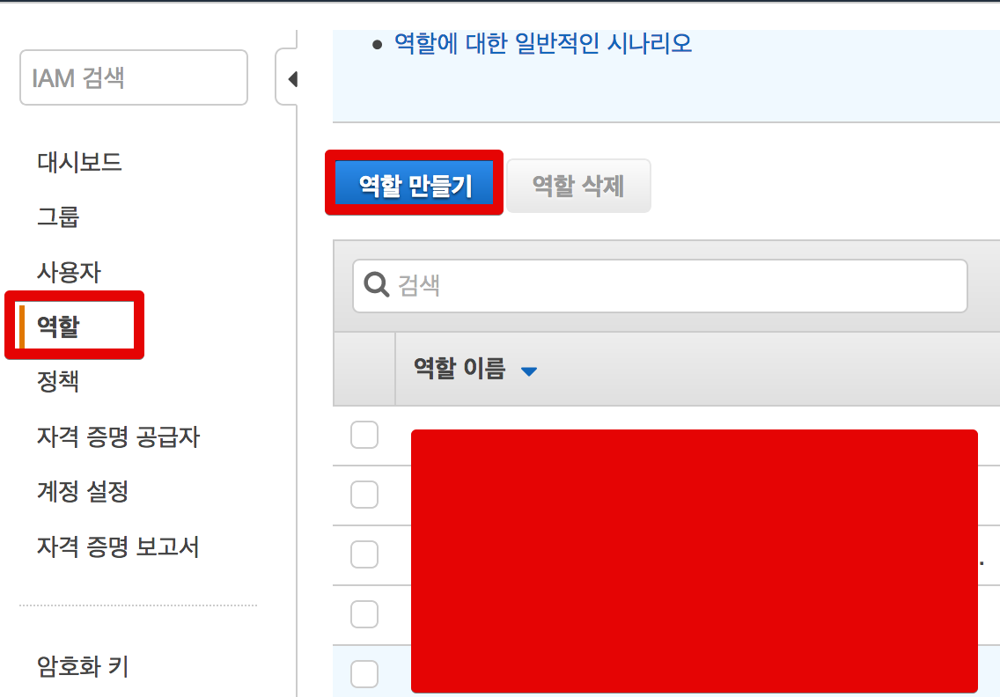
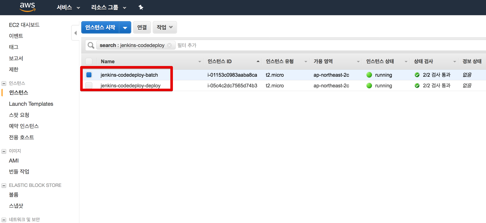
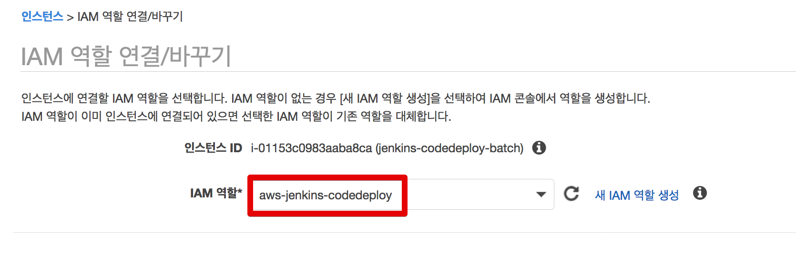
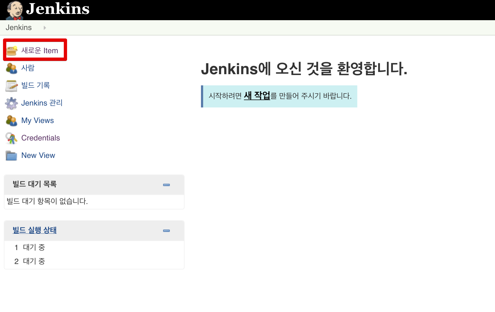
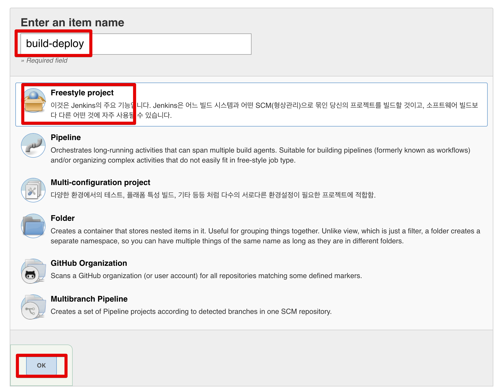
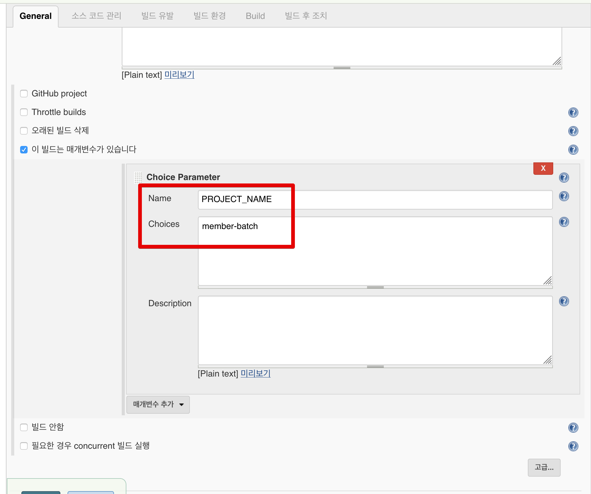
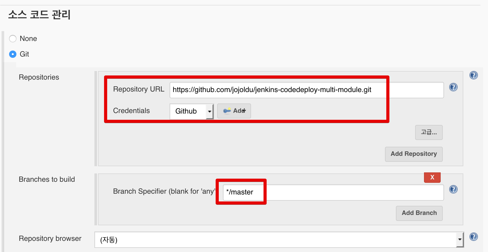

# AWS Code Deploy로 배포 Jenkins에서 배치 Jenkins로 Spring Batch 배포하기

안녕하세요? 이번 시간엔 jenkins-codedeploy-multi-module 예제를 진행해보려고 합니다.  
모든 코드는 [Github](https://github.com/jojoldu/jenkins-codedeploy-multi-module)에 있기 때문에 함께 보시면 더 이해하기 쉬우실 것 같습니다.  


## 0. 들어가며

> 여기서는 [Gradle Multi Module](http://jojoldu.tistory.com/123)로 구성된 프로젝트를 기준으로 합니다.  

Spring Batch의 Trigger를 관리하는 방법은 크게 3가지가 있습니다.

* Linux의 crontab
* Spring Quartz
* Jenkins

보통 Linux의 crontab과 Spring Quartz를 많이들 사용하시는데요.  
Jenkins가 생각보다 Spring Batch 관리용으로 유용하고 효율적입니다.  

> 현재 제가 속해있는 팀에서도 적극적으로 Jenkins를 Batch 관리로 사용중인데요.  
기회가 되면 이 부분도 한번 정리하겠습니다 :)

Jenkins로 Spring Batch를 관리하기 위해서 지켜주셔야할 것은 **배포용 Jenkins와 Batch용 Jenkins를 분리하는 것**입니다.  
여기선 이 2개가 분리되어있다는 가정하에 시작합니다.  

## 1. AWS 환경 설정

**배포용 Jenkins**와 **Batch용 Jenkins**로 Jenkins는 **총 2대**가 필요합니다.  
아직 구축이 안되있으시다면, 이전에 작성한 [EC2에 Jenkins 설치하기](http://jojoldu.tistory.com/290) 을 참고해서 설치하시면 됩니다.  
  
여기서 주의하실 점은 **IAM Role에 S3**가 포함되있어야 합니다.  
만약 없으시다면 아래를 따라 변경해주시면 됩니다.




아래처럼 배포용 Jenkins와 Batch용 Jenkins 2대의 IAM Role에 새로 만든 IAM Role을 할당합니다.






추가로 **Code Deploy용 IAM Role**도 생성합니다.


### S3 Bucket 생성

배포할 zip 파일을 관리할 S3 Bucket도 생성합니다.


저는 bucket명을 ```dwlee-member-deploy```으로 하겠습니다.


> 배포 Jenkins에서 사용해야하니 bucket명은 어딘가에 적어주시면 좋습니다.


### Code Deploy 생성

## 2. 배포 Jenkins 환경 설정

배포 Jenkins에서 Github에 올라간 코드를 가져올 수 있도록 Github과 연동이 필요합니다.  
> Jenkins와 Github 연동은 [이전에 작성된 포스팅](http://jojoldu.tistory.com/291)를 참고해서 진행하시는것을 추천드립니다.

**연동이 되셨으면** 배포 Job을 생성하겠습니다.







소스코드 관리에서는 배포할 프로젝트의 Github 주소를 등록합니다.



배포 스크립트 내용은 좀 길어서 아래 코드를 그대로 복사해주세요.


```bash
DEPLOY_DIR_NAME=code-deploy-${PROJECT_NAME}
APP_NAME='dwlee-member'
BUCKET='dwlee-member-deploy'
ZIP_NAME=${PROJECT_NAME}-${GIT_COMMIT}-${BUILD_TAG}.zip

./gradlew :${PROJECT_NAME}:clean :${PROJECT_NAME}:build

echo "	> 배포.zip 생성"
mkdir -p ${DEPLOY_DIR_NAME}
cp ${PROJECT_NAME}/code-deploy/*.yml ${DEPLOY_DIR_NAME}/
cp ${PROJECT_NAME}/code-deploy/*.sh ${DEPLOY_DIR_NAME}/
cp ${PROJECT_NAME}/build/libs/*.jar ${DEPLOY_DIR_NAME}/

cd ${DEPLOY_DIR_NAME}
zip -r ${DEPLOY_DIR_NAME} *

echo "	> AWS S3 업로드"
aws s3 cp ${DEPLOY_DIR_NAME}.zip s3://${BUCKET}/${ZIP_NAME} --region ap-northeast-2

echo "	> AWS CodeDeploy 배포"
aws deploy create-deployment \
--application-name ${APP_NAME} \
--deployment-group-name ${PROJECT_NAME} \
--region ap-northeast-2 \
--s3-location bucket=${BUCKET},bundleType=zip,key=${ZIP_NAME}

echo "	> 생성된 디렉토리 삭제"
cd ..
rm -rf ${DEPLOY_DIR_NAME}
```

* ```./gradlew :${PROJECT_NAME}:clean :${PROJECT_NAME}:build```
    * 멀티 모듈 프로젝트이기 때문에 지정한 프로젝트를 Build 하도록 합니다.
* 배포.zip 생성
    * 하위 프로젝트의 ```code-deploy``` 디렉토리 안에 있는 yml, sh파일과 build된 jar파일을 하나의 zip으로 묶습니다.
* AWS S3 업로드
    * S3에 배포.zip 파일을 올립니다.
* AWS CodeDeploy 배포
    * 업로드한 S3 파일로 Code Deploy 배포를 진행합니다.

자 이렇게 하면 배포 Jenkins의 설정은 끝이 납니다.

## 3. 프로젝트 설정

Gradle Multi Module 


#### appspec.yml

```yaml
version: 0.0
os: linux
files:
  - source:  /
    destination: /home/jenkins/member-batch/deploy

permissions:
  - object: /
    pattern: "**"
    owner: jenkins
    group: jenkins

hooks:
  ApplicationStart:
    - location: deploy.sh
      timeout: 60
      runas: ec2-user
```

deploy

```bash
ORIGIN_JAR_PATH='/home/jenkins/member-batch/deploy/*.jar'
ORIGIN_JAR_NAME=$(basename ${ORIGIN_JAR_PATH})
TARGET_PATH='/home/jenkins/member-batch/application.jar'
JAR_BOX_PATH='/home/jenkins/member-batch/jar/'

echo "  > 배포 JAR: "${ORIGIN_JAR_NAME}

echo "  > chmod 770 ${ORIGIN_JAR_PATH}"
sudo chmod 770 ${ORIGIN_JAR_PATH}

echo "  > cp ${ORIGIN_JAR_PATH} ${JAR_BOX_PATH}"
sudo cp ${ORIGIN_JAR_PATH} ${JAR_BOX_PATH}

echo "  > chown -h jenkins:jenkins ${JAR_BOX_PATH}${ORIGIN_JAR_NAME}"
sudo chown -h jenkins:jenkins ${JAR_BOX_PATH}${ORIGIN_JAR_NAME}

echo "  > sudo ln -s -f ${JAR_BOX_PATH}${ORIGIN_JAR_NAME} ${TARGET_PATH}"
sudo ln -s -f ${JAR_BOX_PATH}${ORIGIN_JAR_NAME} ${TARGET_PATH}
```

SampleBatchConfiguration.java

```java
@Slf4j
@Configuration
public class SampleBatchConfiguration {

    public static final String JOB_NAME = "sampleBatch";
    public static final String BEAN_PREFIX = JOB_NAME + "_";

    @Autowired
    JobBuilderFactory jobBuilderFactory;

    @Autowired
    StepBuilderFactory stepBuilderFactory;

    @Value("${chunkSize:1000}")
    private int chunkSize;

    @Bean(BEAN_PREFIX + "job")
    public Job job() {
        return jobBuilderFactory.get(JOB_NAME)
                .start(step())
                .build();
    }

    @Bean(BEAN_PREFIX + "step")
    public Step step() {
        return stepBuilderFactory.get("step")
                .tasklet((contribution, chunkContext) -> {
                    log.info("샘플 배치입니다!");
                    return RepeatStatus.FINISHED;
                })
                .build();
    }
}
```

## 4. 배치용 Jenkins 실행
